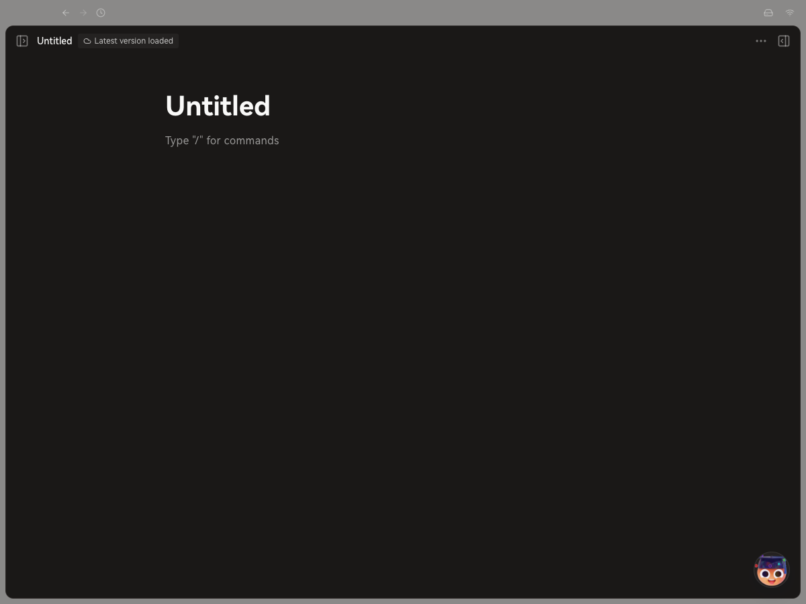
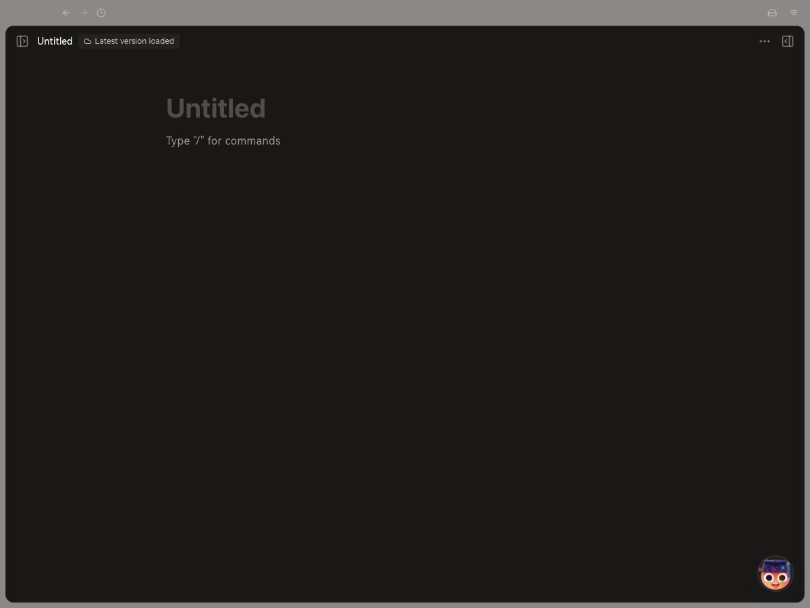
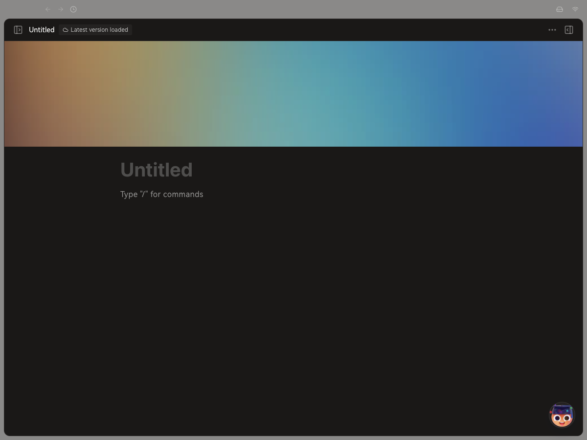
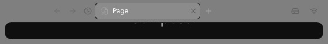
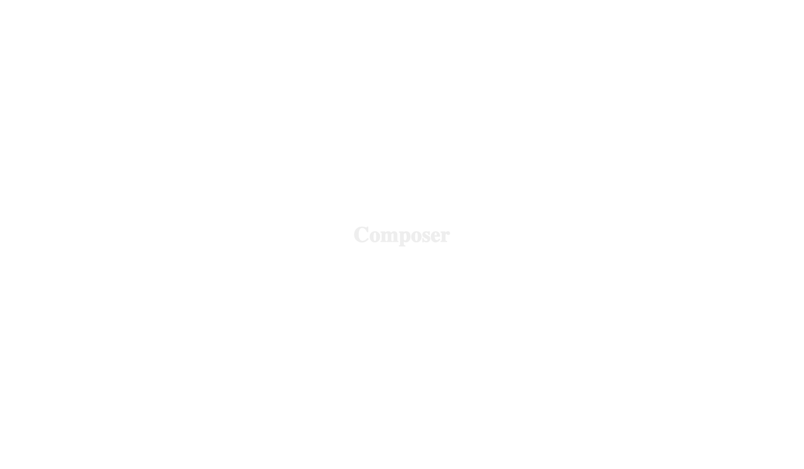

# Notion-Like Page Editor Session Report

Date: 2026-06-10
Repo: `/Users/sharathnair/coding/lobehub-desktop-ui`
Branch: `canary`

## Summary

Completed Phases 1-9 with one commit per phase. Phase 10 was attempted after a fresh dev Electron relaunch, but the SPA remained stuck at the `Composer` loading state on both `/project` and the page detail route, so the requested end-to-end editor regression workflow could not be performed.

Per the later instruction to use only the dev Electron app, external Safari/Notion inspection was not performed in this pass. Visual validation used `agent-browser`; no Playwright was used.

## Phases

| Phase                  | Status                                 | Commit         | Notes                                                                                                                            |
| ---------------------- | -------------------------------------- | -------------- | -------------------------------------------------------------------------------------------------------------------------------- |
| 1. Typography & Tokens | Done                                   | `5bacc29fa`    | Added scoped page editor typography tokens, body/code/link/selection styles, and title treatment.                                |
| 2. Page Chrome         | Done                                   | `83dbae1ce`    | Added page cover shell, tighter header, title/icon sizing, and content layout polish.                                            |
| 3. Block Editor        | Done, visual blocked after code checks | `565ac7f66`    | Added hover/focus surface, drag/add handle visibility, placeholder and selection polish.                                         |
| 4. Slash Menu          | Done, visual blocked after code checks | `fd5e5c48d`    | Reworked slash menu container, item layout, search, hover/active states, section labels, and keyboard state styling.             |
| 5. Inline Toolbar      | Done, visual blocked after code checks | `69fdba45e`    | Added dark floating toolbar shell, grouped controls, text-type selector, link/action states, and inline AI prompt shell styling. |
| 6. Block Types         | Done, visual blocked after code checks | `b34e5bdbf`    | Styled paragraph-adjacent blocks: headings, lists, checklists, toggles, quote, callout, code, divider, image/caption.            |
| 7. Inline Table        | Done, visual blocked after code checks | `bf7bad83a`    | Styled table wrapper, cells, headers, row hover, add row/column affordances, and resize handle. Timebox respected.               |
| 8. Notion AI UI Shells | Done, visual blocked after code checks | `f94ed38fb`    | Added sparkle entry points, AI island shell behavior, slash Ask AI item, and backend TODO comments. No AI logic added.           |
| 9. Micro-Interactions  | Done, visual blocked after code checks | `5bb63c697`    | Added 80-120ms block/toggle/table motion, reduced-motion handling, and page menu font/small-text controls.                       |
| 10. Regression Pass    | Blocked                                | No code commit | Fresh Electron relaunch timed out waiting for the renderer; `/project` and `/page/mxrK6wfv7Y3RYlWw` rendered only `Composer`.    |

## Files Changed By This UI Pass

- `src/features/EditorCanvas/InlineToolbar.tsx`
- `src/features/EditorCanvas/InternalEditor.tsx`
- `src/features/PageEditor/EditorCanvas/PageAiIsland.tsx`
- `src/features/PageEditor/EditorCanvas/useAskCopilotItem.tsx`
- `src/features/PageEditor/EditorCanvas/useSlashItems.tsx`
- `src/features/PageEditor/Header/index.tsx`
- `src/features/PageEditor/Header/useMenu.tsx`
- `src/features/PageEditor/PageEditor.tsx`
- `src/features/PageEditor/TitleSection.tsx`
- `src/features/PageEditor/store/initialState.ts`
- `src/locales/default/file.ts`

## Verification

Passing checks run during the session:

- `bunx prettier --check src/features/PageEditor/Header/useMenu.tsx src/locales/default/file.ts src/features/EditorCanvas/InternalEditor.tsx`
- `git diff --check`
- `bunx vitest run --silent='passed-only' 'src/features/EditorCanvas/EditorCanvas.test.tsx' 'src/features/EditorCanvas/InlineToolbar.test.tsx'`

Known test issue:

- `src/features/EditorCanvas/InternalEditor.test.tsx` still fails with the pre-existing `TypeError: localStorage.getItem is not a function` from `packages/utils/src/localStorage.ts`.

Visual validation:

- Successful screenshots were captured for the initial editor and early typography/page chrome phases.
- Later phases were blocked by the dev Electron route rendering only loader/debug states.
- Fresh Phase 10 relaunch timed out waiting for renderer readiness and showed only `Composer`.

## Top Screenshot Artifacts

- Baseline editor: `session-artifacts/screenshots/00-electron-editor-baseline.png`
- Typography after: `session-artifacts/screenshots/01-phase1-typography-editor-after.png`
- Page chrome after: `session-artifacts/screenshots/02-phase2-page-chrome-after.png`
- Phase 9 blocked check: `session-artifacts/screenshots/09-phase9-micro-interactions-check.png`
- Phase 10 fresh-launch blocker: `session-artifacts/screenshots/10-regression-fresh-launch.png`
- Phase 10 page-route blocker: `session-artifacts/screenshots/10-regression-page-route-blocked.png`

### Screenshot Evidence

Baseline:

Typography after:

Page chrome after:

Phase 9 visual blocker:

Phase 10 fresh-launch blocker:

## Remaining Gaps By Severity

### High

- Phase 10 end-to-end regression could not run because the fresh dev Electron app stayed at `Composer` loading.
- Multi-block selection behavior is styled only at the selection surface; Notion-level drag selection mechanics were not implemented.
- Cover image and emoji icon styling are presentational shells only; real persistence and user-driven cover/icon flows still need product/store integration.
- Live computed-style extraction from Notion was skipped after the instruction to use only the dev Electron app.

### Medium

- Slash menu structure and styling are close, but not a byte-for-byte copy of Notion HTML because the local editor emits its own menu structure.
- Toggle, callout, code block language selector, copy button, and image caption selectors are styled defensively; each needs DOM verification once the editor route loads reliably.
- Inline table filter/sort bar is not implemented because the current table plugin did not expose that surface in this pass.
- Sidebar collapse and exact route chrome motion need a dedicated visual pass once the Electron shell reliably renders.

### Low

- Transition values are Notion-like 80-120ms approximations rather than extracted computed values.
- Header page font controls use localStorage-backed client state; syncing across devices is out of scope.
- Some exact color values use app theme tokens and `color-mix` instead of hard-coded Notion colors so dark/light themes remain coherent.

## Backend Or Store Work Needed

- Wire AI shell entry points to the real AI backend. Current TODO markers are intentional:
  - `PageAiIsland.tsx`
  - `useAskCopilotItem.tsx`
  - `useSlashItems.tsx`
  - `InternalEditor.tsx`
- Persist page cover image, emoji icon, font, and small-text preferences if those should be document-level settings rather than local UI preferences.
- Add any missing table metadata APIs if filter/sort bars should behave like Notion database/table views.

## Non-Replicable Or Not Attempted Notion Features

- Notion AI generation logic and response quality were intentionally not replicated.
- Exact Notion account/session behavior, collaboration presence, live cursors, and proprietary block internals were not replicated.
- Pixel-perfect Notion computed styles were not extracted from Safari in this pass due the later dev-Electron-only instruction.

## Commit Log

- `5bacc29fa phase 1: typography tokens`
- `83dbae1ce phase 2: page chrome`
- `565ac7f66 phase 3: block editor interactions`
- `fd5e5c48d phase 4: slash menu styling`
- `69fdba45e phase 5: inline toolbar styling`
- `b34e5bdbf phase 6: block type styling`
- `bf7bad83a phase 7: inline table styling`
- `f94ed38fb phase 8: notion ai shells`
- `5bb63c697 phase 9: micro interactions`
